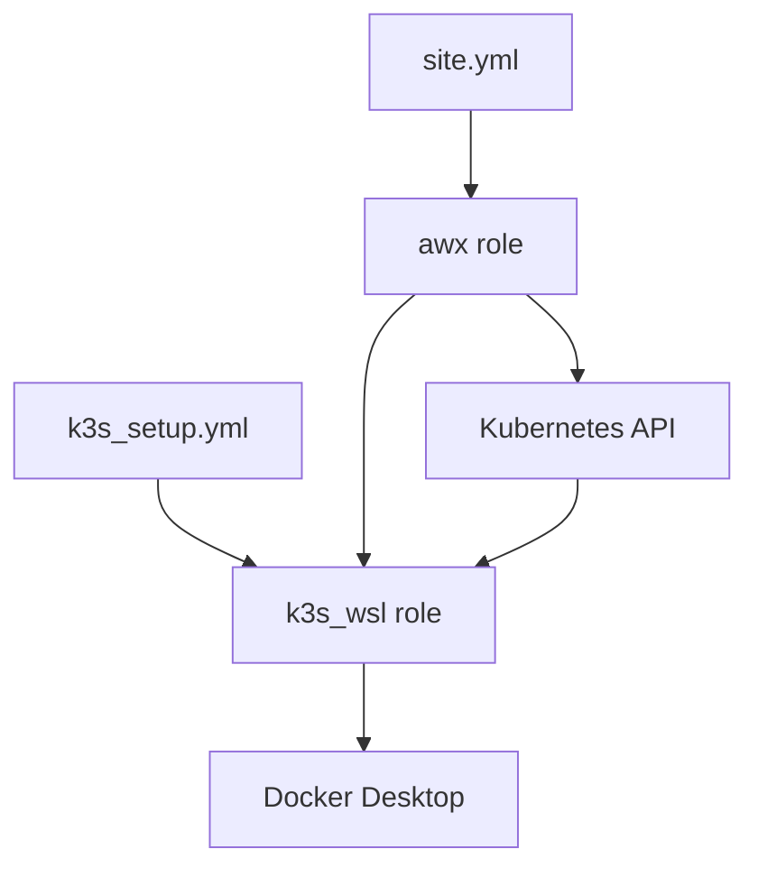

# AWX Lab Setup Guide

This guide documents the complete process of setting up AWX in a WSL environment using K3s and Docker Desktop. It includes all steps, explanations, troubleshooting, and best practices.

## Project Structure

```
awx-lab/
├── inventory                 # Inventory file for Ansible
├── k3s_setup.yml            # Playbook for K3s installation
├── site.yml                 # Main playbook for AWX installation
└── roles/
    ├── k3s_wsl/            # Role for K3s setup in WSL
    └── awx/                # Role for AWX deployment
```

## Prerequisites

1. Windows System Requirements:
   - Windows 10/11 with WSL2
   - Docker Desktop installed and running
   - Minimum 8GB RAM
   - 4+ CPU cores
   - 20GB free disk space

2. WSL Environment:
   - Oracle Linux (OEL) 9
   - Python 3.9+
   - pip3

3. Required Software Versions:
   - K3s v1.32.x or later
   - Helm v3.17.x or later
   - Docker Desktop with WSL integration

## Prerequisite Verification Commands

Before proceeding with the playbook execution, run these commands to verify all requirements are met:

### 1. Kubernetes Cluster Check
```bash
# Verify K3s/Kubernetes cluster is running and healthy
kubectl get nodes
kubectl cluster-info
kubectl version --client

# Check for any existing resources
kubectl get all --all-namespaces
```

### 2. Container Runtime Check
```bash
# Verify Docker installation and version
docker version
docker info | grep -E "Server Version|OS Type|Kernel Version|Total Memory"

# Check Docker service status
systemctl status docker

# Test Docker functionality
docker run hello-world
```

### 3. Python Environment Check
```bash
# Verify Python version
python3 -V

# Check pip installation
pip3 -V

# Verify required Python packages
pip3 list | grep kubernetes
pip3 list | grep openshift
pip3 list | grep ansible

# Check package versions meet minimum requirements
python3 -c "import kubernetes; print(f'kubernetes version: {kubernetes.__version__}')"
python3 -c "import openshift; print(f'openshift version: {openshift.__version__}')"
```

### 4. System Resources Check
```bash
# Check available memory
free -h

# Check CPU resources
nproc
lscpu

# Check available disk space
df -h /var/lib/rancher
df -h /var/lib/docker
```

### 5. Network Configuration
```bash
# Check network interfaces
ip addr show

# Verify DNS resolution
nslookup kubernetes.default.svc.cluster.local

# Check required ports
netstat -tulpn | grep -E ':6443|:80|:443'
```

### 6. WSL Environment Check
```bash
# Verify WSL version
wsl --version
wsl --status

# Check Linux distribution
cat /etc/os-release

# Verify systemd status (required for some services)
ps -p 1 -o comm=
```

### Single-Command Quick Check
```bash
# Quick verification of core components
kubectl get nodes && docker version && python3 -V
```

Run all these checks and ensure they pass successfully before proceeding with the playbook execution. Address any issues found before continuing.

## Initial Setup Steps

### 1. Environment Verification

Check WSL and Docker Desktop integration:
```bash
# Verify WSL version
wsl --version

# Check Docker integration
docker info

# Verify Python version
python3 --version
```

### 2. Python Dependencies

Install required Python packages:
```bash
pip3 install kubernetes>=12.0.0 openshift>=0.12.0
```

## K3s Installation (k3s_setup.yml)

The K3s setup playbook (`k3s_setup.yml`) handles the installation and configuration of K3s in WSL.

### Key Tasks:

1. **Prerequisites Check** (`roles/k3s_wsl/tasks/prerequisites.yml`):
   - Verifies WSL environment
   - Installs required packages
   - Checks Docker Desktop integration

2. **K3s Configuration** (`roles/k3s_wsl/tasks/configure_k3s.yml`):
   - Sets up K3s configuration
   - Configures networking settings
   - Handles storage setup

3. **kubectl Setup** (`roles/k3s_wsl/tasks/configure_kubectl.yml`):
   - Creates kubectl symlink
   - Sets up kubeconfig
   - Configures environment variables

### Common Issues and Solutions:

1. **kubectl Not Found**:
   ```bash
   # Fix kubectl symlink
   sudo rm -f /usr/local/bin/kubectl
   sudo ln -s /usr/local/bin/k3s /usr/local/bin/kubectl
   ```

2. **Storage Class Issues**:
   ```bash
   # Verify storage class
   kubectl get storageclass
   ```

## AWX Installation (site.yml)

The AWX installation playbook (`site.yml`) deploys AWX using the AWX Operator.

### Components:

1. **AWX Operator Deployment** (`roles/awx/tasks/deploy_operator.yml`):
   - Creates AWX namespace
   - Deploys AWX operator using kustomize
   - Sets up required RBAC

2. **AWX Instance Deployment** (`roles/awx/tasks/deploy_awx.yml`):
   - Creates AWX custom resource
   - Configures PostgreSQL storage
   - Sets up service access

### Resource Requirements:

```yaml
# Database
- CPU: 500m
- Memory: 2Gi
- Storage: 8Gi

# Web Interface
- CPU: 500m
- Memory: 1Gi

# Task Handler
- CPU: 500m
- Memory: 2Gi
```

## Deployment Process

1. **Verify Environment**:
   ```bash
   # Check K3s cluster
   kubectl get nodes
   
   # Verify storage class
   kubectl get storageclass
   ```

2. **Deploy AWX**:
   ```bash
   # Run installation playbook
   ansible-playbook -i inventory site.yml
   ```

3. **Monitor Deployment**:
   ```bash
   # Watch pod status
   kubectl get pods -n awx -w
   
   # Check operator logs
   kubectl logs -n awx -l control-plane=controller-manager
   ```

## Troubleshooting Guide

### Common Issues:

1. **Pod Scheduling Issues**:
   - Check node resources:
     ```bash
     kubectl describe node
     ```
   - Verify pod status:
     ```bash
     kubectl describe pod -n awx <pod-name>
     ```

2. **Storage Issues**:
   - Check PVC status:
     ```bash
     kubectl get pvc -n awx
     ```
   - Verify storage class:
     ```bash
     kubectl describe storageclass local-path
     ```

3. **Network Issues**:
   - Verify service:
     ```bash
     kubectl get svc -n awx
     ```
   - Check node ports:
     ```bash
     kubectl get svc awx-service -n awx
     ```

### Cleanup Process

To remove AWX and clean up resources:

```bash
# Delete AWX instance
kubectl delete awx awx -n awx

# Delete operator
kubectl delete deployment awx-operator-controller-manager -n awx

# Remove PVCs
kubectl delete pvc --all -n awx

# Delete namespace
kubectl delete namespace awx
```

## Accessing AWX

After successful deployment:
- URL: `http://localhost:30080`
- Default credentials:
  - Username: admin
  - Password: password123 (change this in production!)

## Best Practices

1. **Resource Management**:
   - Monitor resource usage
   - Scale resources based on needs
   - Use resource limits

2. **Security**:
   - Change default passwords
   - Use secure storage
   - Implement proper RBAC

3. **Maintenance**:
   - Regular backups
   - Monitor logs
   - Keep AWX operator updated

## References

1. [AWX Operator Documentation](https://github.com/ansible/awx-operator)
2. [K3s Documentation](https://docs.k3s.io/)
3. [AWX Project](https://github.com/ansible/awx)
4. [Ansible Documentation](https://docs.ansible.com/)

## Understanding Task and Role Relationships

### 1. K3s Role (`k3s_wsl`)
This role handles all K3s-related setup:

```
k3s_wsl/
├── tasks/
│   ├── main.yml              # Primary task orchestrator
│   ├── prerequisites.yml     # System requirements and checks
│   ├── configure_k3s.yml     # K3s configuration
│   ├── configure_kubectl.yml # kubectl setup
│   ├── install_k3s.yml      # K3s binary installation
│   ├── start_k3s.yml        # K3s service startup
│   └── verify_k3s.yml       # Installation verification
├── templates/
│   └── config.yaml.j2       # K3s configuration template
└── defaults/
    └── main.yml             # Default variables
```

**Task Flow**:
1. main.yml → Checks WSL environment
2. prerequisites.yml → Installs dependencies
3. install_k3s.yml → Downloads and installs K3s
4. configure_k3s.yml → Sets up K3s configuration
5. configure_kubectl.yml → Sets up kubectl
6. start_k3s.yml → Starts K3s service
7. verify_k3s.yml → Verifies installation

### 2. AWX Role (`awx`)
This role manages AWX deployment:

```
awx/
├── tasks/
│   ├── main.yml               # Primary task orchestrator
│   ├── check_requirements.yml # System requirements check
│   ├── install_dependencies.yml # AWX dependencies
│   ├── deploy_operator.yml    # AWX operator deployment
│   ├── deploy_awx.yml        # AWX instance deployment
│   └── verify_deployment.yml  # Deployment verification
└── defaults/
    └── main.yml              # AWX configuration defaults
```

**Task Flow**:
1. main.yml → Orchestrates AWX deployment
2. check_requirements.yml → Verifies prerequisites
3. install_dependencies.yml → Installs required packages
4. deploy_operator.yml → Deploys AWX operator
5. deploy_awx.yml → Creates AWX instance
6. verify_deployment.yml → Validates deployment

### Role Dependencies



## Debugging and Log Collection

### 1. Playbook Debugging

Run playbooks with increased verbosity:
```bash
# Show task results
ansible-playbook -i inventory site.yml -v 

# Show task results and task configuration
ansible-playbook -i inventory site.yml -vv

# Show connection information
ansible-playbook -i inventory site.yml -vvv

# Show all debugging information
ansible-playbook -i inventory site.yml -vvvv
```

### 2. Component Logs

#### K3s Logs
```bash
# K3s service logs
sudo tail -f /var/log/k3s/k3s.log

# Container logs
sudo crictl logs <container-id>
```

#### AWX Operator Logs
```bash
# Get operator logs
kubectl logs -n awx -l control-plane=controller-manager -f

# Get AWX pod logs
kubectl logs -n awx -l app.kubernetes.io/name=awx -f
```

#### PostgreSQL Logs
```bash
# Get database logs
kubectl logs -n awx -l app.kubernetes.io/name=postgresql -f
```

### 3. Resource State Debugging

#### Kubernetes Resources
```bash
# Get detailed resource information
kubectl describe awx awx -n awx
kubectl describe pods -n awx
kubectl describe pvc -n awx
kubectl describe svc -n awx

# Get resource events
kubectl get events -n awx --sort-by='.lastTimestamp'
```

#### WSL and Docker
```bash
# Check WSL status
wsl --status
wsl --list --verbose

# Docker logs
docker logs <container-id>
docker events
```

### 4. Network Debugging

```bash
# Check service endpoints
kubectl get endpoints -n awx

# Test network connectivity
kubectl run -n awx -it --rm debug --image=busybox --restart=Never -- wget -qO- http://awx-service:80

# Port forwarding for debugging
kubectl port-forward -n awx svc/awx-service 8080:80
```

### 5. Common Error Patterns and Solutions

1. **Pod Stuck in Pending**
   - Check node resources
   - Verify PVC binding
   - Check node affinity rules

2. **CrashLoopBackOff**
   - Check container logs
   - Verify resource limits
   - Check configuration

3. **Network Issues**
   - Verify service configuration
   - Check network policies
   - Validate DNS resolution

4. **Storage Issues**
   - Check storage class
   - Verify PV provisioner
   - Check volume permissions

## Performance Monitoring

### Resource Usage
```bash
# Node metrics
kubectl top nodes

# Pod metrics
kubectl top pods -n awx

# Container metrics
kubectl exec -n awx <pod-name> -- top -b -n 1
```

### Database Performance
```bash
# PostgreSQL metrics
kubectl exec -n awx <postgres-pod> -- pg_top
```

This completes the comprehensive guide for setting up, managing, and troubleshooting AWX in a WSL environment.